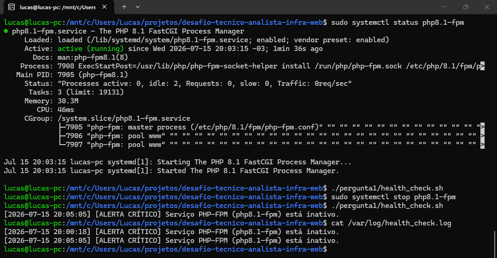

## Parte Teórica

### Comandos de diagnóstico
Quando ocorre um erro 502, o Nginx não conseguiu se comunicar adequadamente com o upstream (neste caso, o PHP-FPM). Para diagnosticar, eu utilizaria:
* `systemctl status nginx php8.1-fpm`: Para verificar se os processos estão rodando (`active/running`), se falharam ou se estão em loop de reinício. *(Nota: a versão do PHP varia conforme o ambiente).*
* `journalctl -u php8.1-fpm --no-pager | tail -n 50`: Para investigar logs do systemd procurando por crashes do serviço ou falhas na alocação de memória.
* `tail -f /var/log/nginx/error.log`: O log de erro do Nginx apontará exatamente o porquê do 502 (ex: "Connection refused", "Permission denied" ou "Connection reset by peer").
* `ss -xalnp | grep php`: Para verificar se o socket Unix do PHP-FPM está criado e ouvindo conexões, e quais permissões possui.
* `top` ou `htop`: Para avaliar se o servidor está sofrendo de esgotamento de recursos (CPU no limite, RAM em swap), o que pode enfileirar requisições até o timeout.

### 3 causas prováveis de 502 (Nginx + PHP-FPM) e como confirmar
1. **O serviço do PHP-FPM está inativo ou crashou:**
   * **Confirmação:** `systemctl is-active php8.1-fpm` retornará `inactive` ou `failed`. O Nginx logará `Connection refused` ao tentar acessar o socket/porta.
2. **Permissões incorretas no Socket Unix:**
   * **Confirmação:** O Nginx logará `Permission denied` ao tentar conectar ao upstream no `error.log`. Isso ocorre se o usuário do Nginx (ex: `www-data`) não tiver permissão de leitura/escrita no arquivo `/run/php/php-fpm.sock` configurado no pool do FPM (`listen.owner`/`listen.group`).
3. **Esgotamento de processos (Max Children Reached) ou Timeout:**
   * **Confirmação:** O PHP-FPM atingiu o limite de requisições simultâneas e começou a dropar conexões novas. Confirma-se isso olhando o log do próprio FPM (ex: `/var/log/php8.1-fpm.log`), procurando pelo aviso: `server reached pm.max_children`.

### Como diferenciar servidor web vs. aplicação vs. rede
* **Problema de Rede:** A requisição nem chega ao servidor web. Um `curl -v http://dominio` ou um ping/traceroute resultará em timeout (falha de handshake TCP). Falhas de DNS ou firewall (porta 80/443 fechada).
* **Problema no Servidor Web (Nginx/Infra):** O handshake TCP ocorre, a conexão é estabelecida em milissegundos, mas o Nginx devolve um código de erro HTTP de proxy (502, 504) ou um erro próprio de configuração (403, 500).
* **Problema na Aplicação (PHP/WordPress):** O Nginx entrega a requisição ao PHP-FPM com sucesso, mas a aplicação retorna um erro na renderização. Geralmente resulta em um erro HTTP 500 originado pelo PHP, uma Tela Branca da Morte (WSOD), ou o próprio CMS renderiza uma página de "Erro Crítico".

