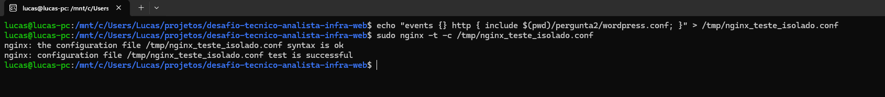

## Parte Teórica

### Relação Nginx x LiteSpeed/LSPHP nesta arquitetura
Neste modelo, o **Nginx** atua como um Proxy Reverso e Web Server de Borda. Ele é responsável por receber as requisições HTTP/HTTPS, lidar com a terminação SSL, aplicar regras de segurança e servir arquivos estáticos de forma extremamente rápida. 
Quando o Nginx identifica uma requisição dinâmica (arquivos `.php`), ele não a processa. Ele encaminha essa requisição para o **LiteSpeed (LSPHP)**, que atua exclusivamente como um *Worker PHP*. O LSPHP é otimizado para executar o código do WordPress de forma mais eficiente que o PHP-FPM tradicional, integrando-se nativamente com plugins de cache.

### Para que serve o LSCache num site WordPress
O LSCache (LiteSpeed Cache) atua fazendo o *Full-Page Cache*. Ele pega o resultado de uma execução pesada do WordPress (que exige consultas ao MariaDB e processamento PHP) e salva isso como uma página HTML estática. Nas próximas requisições, o servidor entrega esse HTML pronto em milissegundos, economizando drasticamente CPU e memória.

**O que NÃO deve ser cacheado e por quê:**
* **Áreas administrativas (`/wp-admin`) e páginas de Login (`wp-login.php`):** Podem expor o painel para usuários não autenticados ou travar o funcionamento de ferramentas administrativas.
* **Páginas dinâmicas de e-commerce (Carrinho de Compras, Checkout):** Fazer cache dessas páginas faria com que o cliente A visse os produtos que o cliente B colocou no carrinho, resultando em vazamento de dados de sessão e inviabilizando vendas.
* **Usuários logados (com cookies de sessão ativos):** O cache deve ser "bypassado" para não exibir páginas genéricas a um usuário que deveria ver seu perfil personalizado.

