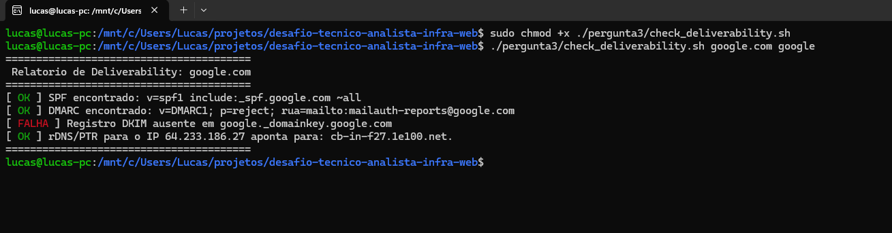

## Parte Teórica

### Onde verificar os logs de entrega no Exim e o que procurar
No Exim (tipicamente no Debian/Ubuntu), o log principal fica em `/var/log/exim4/mainlog`. 
* **O que eu procuraria:** Eu usaria o comando `exigrep` para filtrar mensagens por domínio ou endereço de e-mail específico. Procuraria pelo ID interno da mensagem (ex: `1XYZ-000000-XX`) para rastrear o ciclo de vida dela.
* O foco é identificar o código de retorno SMTP do servidor de destino: um retorno `250 OK` significa que foi entregue com sucesso (se caiu no spam depois, o problema é reputação/DNS). Um retorno `5XX` indica rejeição permanente (bounce), e `4XX` indica falha temporária (greylisting, rate limit).

### Como verificar blacklist e o que comunicar ao cliente
* **Verificação Técnica:** Consultaria o IP do servidor do cliente em ferramentas como MXToolBox ou diretamente em RBLs (Real-time Blackhole Lists) conhecidas, como Spamhaus ou Barracuda.
* **Comunicação ao Cliente (Linguagem não técnica):** 
  "Identificamos que os e-mails estão sendo rejeitados porque o 'endereço IP' do seu servidor de envio está em uma lista de bloqueio (blacklist). Funciona como um 'SPC/Serasa' da internet: se o seu endereço enviou mensagens não solicitadas ou foi comprometido no passado, os outros provedores perdem a confiança e bloqueiam a entrega por segurança. Vamos iniciar o processo de remoção dessa lista para restaurar sua reputação, mas precisamos garantir que não há envios em massa não autorizados ocorrendo."

### Os Termos de Deliverability (Tríade DNS)
* **SPF (Sender Policy Framework):** É a lista de convidados na porta da festa. É um registro de texto no DNS que diz publicamente: "Apenas estes endereços IP têm permissão para enviar e-mails em nome do meu domínio".
* **DKIM (DomainKeys Identified Mail):** É um selo de cera em uma carta. É uma assinatura criptográfica invisível adicionada ao e-mail. O servidor de destino usa a chave pública no DNS para abrir o "selo" e confirmar que o conteúdo da mensagem não foi alterado no meio do caminho.
* **DMARC (Domain-based Message Authentication, Reporting, and Conformance):** São as instruções de segurança para o porteiro. Ele diz ao provedor de destino (Gmail, Outlook) o que fazer se o e-mail falhar nas checagens de SPF ou DKIM: "Deixe passar mesmo assim (none)", "Mande para a caixa de Spam (quarantine)" ou "Rejeite imediatamente (reject)".
* **PTR/rDNS (Reverse DNS):** É como cruzar a placa do carro com o documento. Em vez de perguntar "Qual IP responde por este domínio?", ele pergunta "Qual domínio responde por este IP?". Muitos provedores descartam e-mails de IPs sem nome ou com nomes genéricos.

