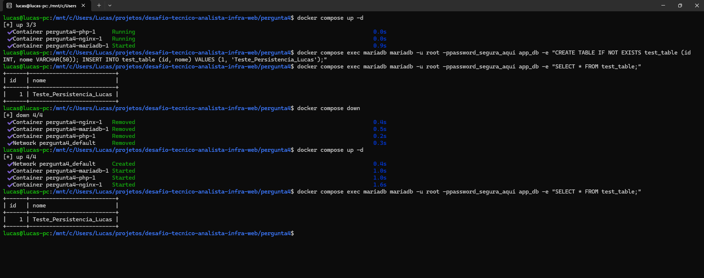

## Parte Teórica

### Vantagem de usar containers em vez de configurar manualmente
A principal vantagem é a **imutabilidade e portabilidade**. Ao usar containers, eliminamos o problema de "na minha máquina funciona", pois a aplicação e todas as suas dependências (Nginx, PHP, bibliotecas do SO) são empacotadas juntas. Além disso, o provisionamento torna-se documentado via código (IaC), permitindo subir, destruir e recriar ambientes em segundos, o que é inviável em configurações manuais.

### O que significa idempotência nesse contexto?
Idempotência é a garantia de que uma operação pode ser executada várias vezes sem alterar o resultado além da primeira aplicação. 
No contexto do Docker Compose, se você rodar `docker compose up -d` num ambiente que já está rodando e configurado, **absolutamente nada acontece**. O daemon do Docker verifica que o estado atual dos containers (imagens, portas, redes e volumes) já corresponde exatamente ao declarado no arquivo `docker-compose.yml`, e simplesmente retorna "Running" sem recriar ou interromper os serviços.

