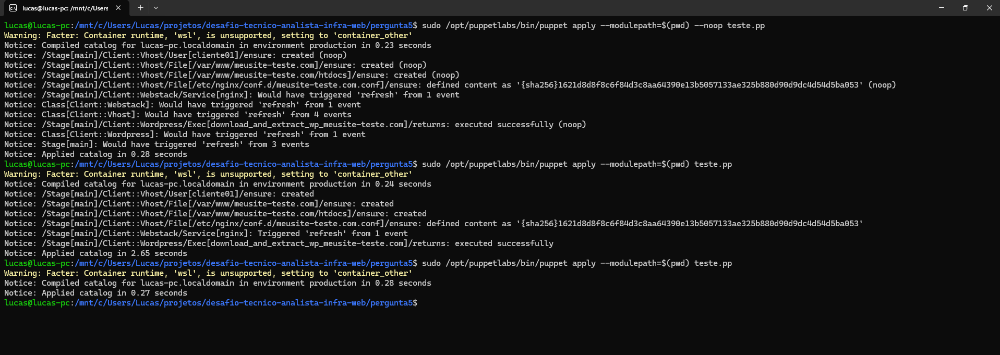

# Pergunta 5 - Provisionamento de cliente com Puppet

Este módulo Puppet (nomeado genericamente como `client` para permitir reuso em arquiteturas multi-tenant) automatiza o provisionamento de novos clientes de hospedagem compartilhada. 

Ele garante a instalação da stack web (Nginx + PHP-FPM simulando LSPHP), o isolamento do usuário, a criação do Virtual Host com regras de cache, e a instalação do WordPress.

## Estrutura do Módulo

A arquitetura foi dividida para respeitar a responsabilidade única de cada manifesto:

* `client/manifests/init.pp`: Classe orquestradora. Recebe os parâmetros e define a ordem de execução.
* `client/manifests/webstack.pp`: Garante a instalação e execução dos pacotes base (Nginx, PHP).
* `client/manifests/vhost.pp`: Cria o usuário do cliente (sem acesso a shell), a estrutura de diretórios (`/var/www/dominio/htdocs`) e gera o arquivo de configuração `.conf` do Nginx.
* `client/manifests/wordpress.pp`: Responsável por baixar e extrair o core do WordPress de forma segura.
* `client/templates/nginx_vhost.erb`: Template Ruby utilizado para injetar dinamicamente o domínio do cliente nas regras do Nginx, incluindo o bypass de cache para áreas do `wp-admin`.

## Parâmetros Esperados

A interface principal do módulo aguarda as seguintes variáveis (definidas na chamada da classe):

```puppet
class client (
  String $client_name,
  String $domain,
)
```


